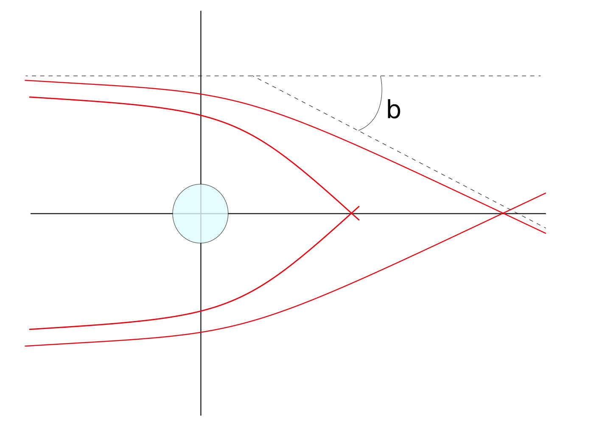
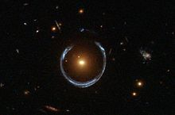
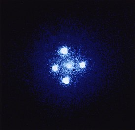
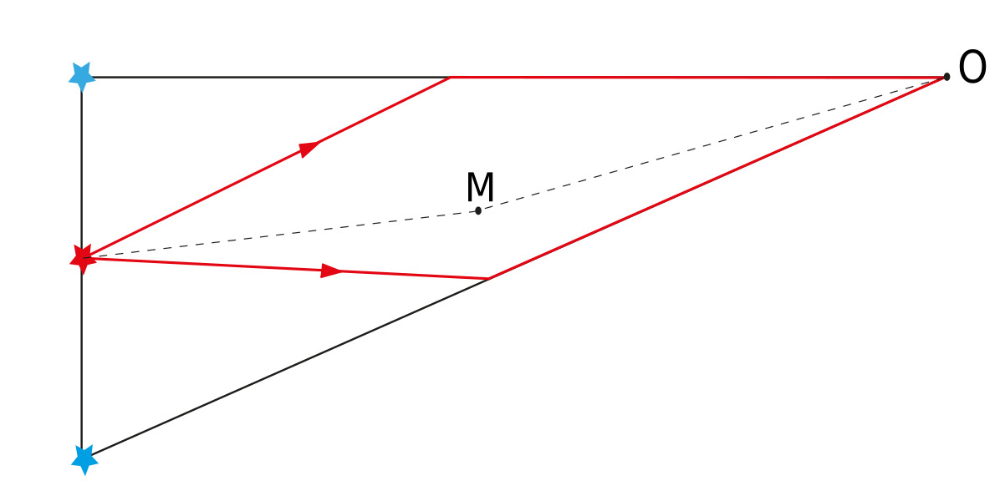
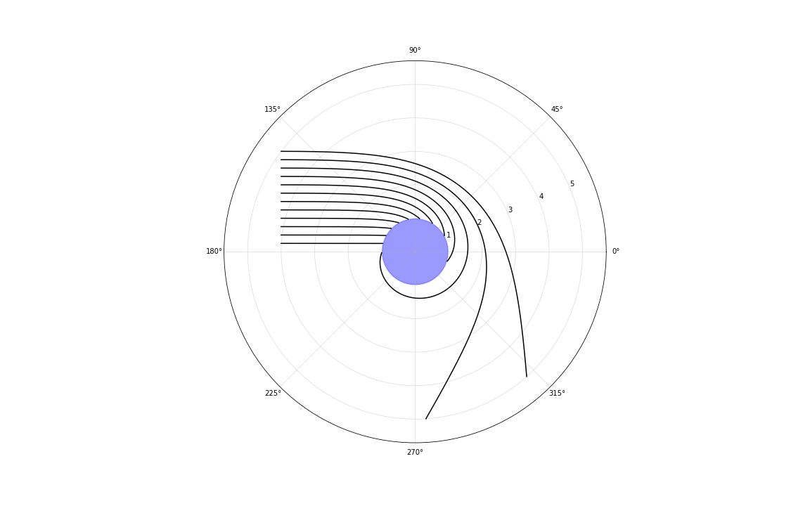
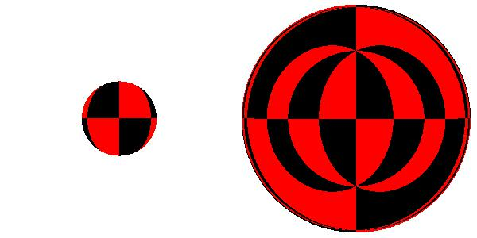
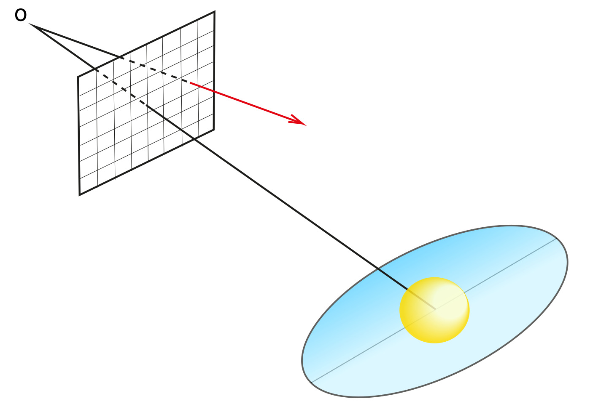
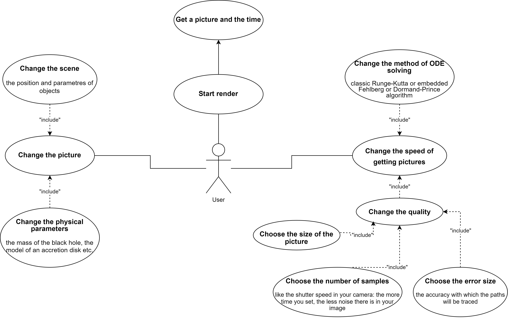
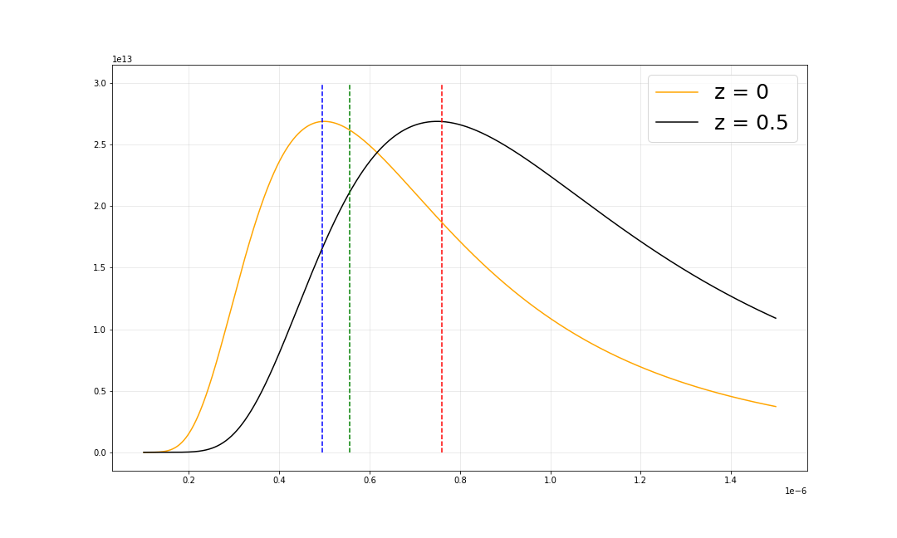
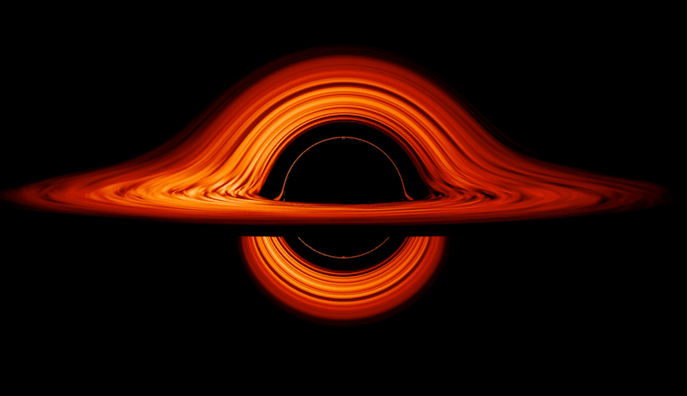

# Моделирование изображения аккреционного диска черной дыры

Автор: Ходарева Е. К.

## Описание проекта

Целью данной работы является моделирование изображения аккреционного диска чёрной дыры звездной массы с учетом искажения траектории света в гравитационном поле. Рассмотрена система A0620-00. Было найдено уравнение движения безмассовой частицы в метрике Шварцшильда. Оно было численно решено с использованием алгоритмов Рунге-Кутты. Цвет диска выбран в приближении абсолютно черного тела. Используя метод трассировки путей, построено изображение и проведено сравнение его с уже имеющимися.

## 1. Свет в гравитационном поле

В 1632 году Галилей сформулировал принцип относительности, гласивший, что законы механики в системах отсчета, движущихся равномерно и прямолинейно в пространстве, имеют тот же вид, что и в системе отсчета, покоящейся в пространстве. Из этого делался вывод, что существует бесконечное множетсво систем отсчёта, называемых инерциальными, которые движутся равномерно и прямолинейно или покоятся друг относительно друга. Но из уравнений Максвелла следует, что скорость света не зависит от системы отсчета, что подтвердили опыты. Это явно противоречило закону сложения скоростей, а следовательно, и принципу относительности Галилея.

Этот кризис разрешил Альберт Эйнштейн. Он не отказался от принципа относительности в формулировке Галилея, но постулировал однородность времени только в рамках одной системы отсчета. Также он распространил принцип относительноси с механических явлений на все физические. Материальная точка заменялсь на событие – физический процесс, происходящий в течение временного промежутка, длительностью которого можно пренебречь в условиях решаемой задачи в области пространства, размерами которой тоже можно пренебречь в условиях решаемой задачи. Событие имеет четыре координаты – три пространственные и одну временную. Таким образом, предполагается существование четырехмерного пространства-времени, в котором расстояние между двумя событиями инвариантно относительно перехода между инерциальными системами отсчета, называется интервалом и имеет вид:

$$ds^2 = c^2dt^2 - dx^2 - dy^2 - dz^2$$

Кроме того, Энштейн постулировал постоянство скорости света и принцип причинности (никакое событие не может влиять на другие события, произошедшие до него).

Эйнштейн пошел дальше: он решил включить в теорию относительности гравитацию. Он распространил принцип относительности на системы, движущиеся ускоренно относительно друг друга. Предполагая равентво инертной и гравитационной масс, он предложил заменять движение в поле тяжести движением в равноускоренной системе отсчета [9].

Ускорение, приобретаемое телом в гравитационном поле, зависит только от свойств гравитирующего тела. Эйнштейн предложил рассматривать движение в гравитационном поле как движение в искривленном пространстве-времени. При этом тело движется по траекториям, вдоль которых изменение интервала минимально. Такие линии называются геодезическими. В 1915 году он записал уравнения, связывающие кривизну четырехмерного пространства-времени с распределением материи в пространстве. И решить уравнения Энштейна значит найти метрический тензор[^1] для известного распределения масс. Одним из точных решений является метрика Шварцшильда, которая описывает поле сферически-симметричной невращающейся массы, не имеющей заряда; она и будет использоваться в дальнейшем.

Из этого следует, что свет в гравитационном поле распространяется не прямолинейно. Это значит, что если между источником света и наблюдателем будет находится массивное тело, то наблюдатель увидит источник в другом направлении. Это явление называется гравитационным линзированием. Название не вполне отражает суть процесса, так как гравитационная линза, в отличие от оптической, не имеет точки фокуса, но имеет «прямую фокуса» [11]. То есть параллельные лучи с одинаковым прицельным параметром пересекаются в одной точке, а точки пересечения лучей с разными прицельными параметрами лежат на одной прямой (рис. 1)


*Рис. 1: Параллельные лучи с разным прицельным параметром*

Подтверждение этой теории было получено экспедицией Эддингтона в 1919 году. Проводились наблюдения Гиад за диском Солнца во время затмения, которые показали, что свет отклоняется на угол $b \approx 1.75''$ (рис. 1), что совпало с предсказаниями теории относительности.

С гравитационным линзированием связано несколько интересных явлений.
Во-первых, наблюдатель может даже увидеть объекты, которые находятся точно за линзирующим объектом. В таком случае источник света будет виден как кольцо вокруг массивного объекта. При отклонении взаимного расположения тел от прямой наблюдатель сможет увидеть только участок дуги. Это явление получило название «кольцо Эйнштейна». Если при этом источник компактный может наблюдаться крест Эйнштейна (рис. 2)



*Рис. 2: Кольцо и крест Эйнштейна (QSO 2237+0305)*

В настоящее время гравитационное линзирование применяется для обнаружния темной материи, двойных звезд и экзопланет. В конце 80-х годов прошлого века были обнаружены скопления галактик, линзирующие более далекие эллиптические галактики или квазары [8]. Изучая изображения последних, можно сделать вывод о распределении масс в скоплениях. Это очень ценный метод изучения скрытой массы, которая обычными способами не наблюдается. Если у далекой звезды есть массивный темный спутник, то во время транзита наблюдатель может видеть два изображения звезды (рис.3). Поток излучения от этой звезды увеличивается, что позволяет обнаружить двойную систему [5].


*Рис. 3: Два изображения одного объекта*

Итак, в метрике Шварцшильда интервал между двумя событиями имеет вид[12]:

$$ ds^2 = (1 - \frac{\mathop {r}_{sh}}{r})c^2dt^2 - \frac{dr^2}{(1 - \frac{\mathop {r}_{sh}}{r})} - r^2d\theta - r^2\sin^2\theta d\phi^2$$

В ней используются координаты Шварцшильда $(t, r, \theta, \phi)$, первая из которых временная, а остальные аналогичны сферическим. По принципу Ферма, найдя минимум этой функции, можно найти уравнение геодезической линии. В метрике Шварцшильда орбита тела лежит в плоскости, поэтому можно сократить количество координат до трёх. Уравнение движения для безмассовой частицы имеет вид [2]:

$$u'' = \frac{3}{2}r_{sh}u^2 - u$$

В этом выражении $u = \mathop {r}^{-1}$, а производная берется по $\phi$. Здесь $\mathop {r}_{sh}$ – это так называемый гравитационный радиус, или радиус Шварцшильда:

$$r_{sh} = \frac{2GM}{c^2}$$

Его физический смысл будет ясен позже, а пока это просто характеристика массивного тела.

Сравнивая полученную формулу c уравнением Бине для движения в центральном поле, можно заметить, что траектории в пространстве с метрикой Шварцшильда эквивалентны траекториям при движении точки единичной массы в центральном поле. Зная начальное положение фотона и направление его скорости, можно построить траекторию его движения. Все предыдущие рассуждения верны для расстояний, меньших радиуса Шварцшильда.

Это уравнение можно решить численно, например, используя алгоритм Рунге-Кутты четвертого порядка, или другие его аналоги по типу RKF45 (Рунге-Кутты-Фельберга) с адаптивным размером шага. На рисунке 4 представлено искажение параллельного пучка лучей в гравитационном поле.


*Рис. 4: Параллельный пучок лучей в гравитационном поле*

Наблюдатель может видеть одновременно все точки поверхности массивного тела. Рисонок 5 представляет собой сравнение двух изображений одного объекта: первое – без учета гравитационного искажения света, другое – с учетом. Аналитически установлено [1], что если радиус массивного объекта равен $r_{sh}$, то радиус его изображения:

$$r = \frac{\sqrt{27}}{2}r_{sh}\approx 2.6r_{sh}$$


*Рис. 5: Изображение массивного объекта радиусом $r_{sh}$*

## 2. Трассировка путей

Для построения этих изображений использовался метод трассировки путей (рис. 6)
Пусть в пространстве есть несколько объектов известной формы и цвета. В пространстве выбирается точка, в которой находится гипотетический наблюдатель. Выбирается экран фиксированного размера и делится на произвольное число пикселей. Далее в случайном направлении от наблюдателя, запускаются пути через каждый пиксель, для того чтобы понять природу источника выбранного луча строится траектория фотона. Устанавливается, какие объекты пересечет эта траектория. В зависимости от свойств этих объектов выбирается цвет пикселя.


*Рис. 6: Трассировка путей*

Для криволинейного распространения света за начальное положение фотона принимается пиксель, а вектор скорости параллелен отрезку наблюдатель – пиксель. Ключевым отличием нашего случая, от обычного трассировщика пути является тот момент, что свет распространяется не по прямой. Чтобы построить его траекторию мы аппроксимируем данную кривую, по которой двигался фотон, ломаной, и, по сути, смотрим пересечение объектов уже не с лучами, а с отрезками, до множества которых мы приблизили нашу кривую. Из чего следует сделать вывод, что качество изображения и его физическая достоверность будет зависеть не только от разрешения самого изображения, но и от размера ошибки, с точностью до которой мы строим ломанную по нашей кривой. Уменьшение размера ошибки приводит к увеличению процессорного времени работы программы, поэтому для получения хорошего изображения необходимо найти некоторый между качеством полученного изображения и временным пределом, за который мы его получаем.


*Рис. 7: UseCase-диаграмма*

## 3. Черные дыры и аккреционные диски

Черная дыра звездной массы может быть компонентом двойной системы. Если вторым компонентом является оптическая звезда, то вещество её верхних слоев перетекает на черную дыру, образуя вокруг последней аккреционный диск. Источник нагрева газа – гравитационная энергия, которая высвобождается при движении по спирали к горизонту событий [3]. Температура вещества аккреционного диска достигает $10^7$K [6]. Кроме того, известно, что она пропорциональна расстоянию от центра в степени -3/4 [4]. Такой диск излучает преимущественно в рентгеновском диапазоне с интенсивностью примерно $10^{29} \div 10^{32}$ Вт [7].

Внутренний радиус аккреционного диска определяется наименьшим радиусом устойчивой орбиты частиц. Он равен трём гравитационным радиусам (для невращающейся и незаряженной черной дыры) [6].

В работе рассмотрена система A0620-00 или V616 Mon, состоящая из компактного объекта, масса которого оценивается от 5 до 17 масс Солнца (взято среднее – $11\mathop{M}_{\odot})$, и звезды спектрального класса K(5-7)V массой примерно $0.7\mathop{M}_{\odot}$. Выбор обусловлен, во-первых, тем, что это очень надежный кандидат в черные дыры [7], а во-вторых, тем, что эта система является одной из ближайших к Солнцу (примерно 3000 световых лет). Для оценки радиуса аккреционного диска обычно используется половина радиуса полости Роша[^2] [6].
В данном случае радиус аккреционного диска примерно равен $14000 r_{sh}$. Но попытка построить изображение всего аккреционного диска бессмысленна; во-первых, его светимость быстро уменьшается по мере удаления от горизонта событий, во-вторых, на таком расстоянии не получится разрешить внутренний радиус аккреционного диска. На мой взгляд, намного интереснее построить изображение центральной области аккреционного диска радиусом, например, $6r_{sh}$. Аккреционный диск наклонен под углом $\frac{\pi}{2} - 0.1$ радиан к картинной плоскости.

## 4. Выбор цветов и красное смещение

Использовано приближение, согласно которому аккреционный диск излучает как абсолютно черное тело. Спектральная яркость в таком случае зависит только от температуры, которую можно вычислить, зная, в какой точке траектория фотона пересекает аккреционный диск.

Используя формулу Планка, я находила яркость на длинах волн 350, 495 и 760 нанометров, что соответствует эффективным длинам волн синего, зеленого и красного каналов соответственно. Далее яркость нормировалась так, чтобы максимальное значение не превышало 255.

В работе учтен эффект гравитационного красного смещения -- изменение длины волны испущенного некоторым источником по мере удаления от массивных объектов. Оно наблюдается как сдвиг всего спектра в сторону большей длины волны [10]:

$$z = \frac{\Delta\lambda}{\lambda} = \frac{1}{\sqrt{1 - r_{sh} / r}} - 1$$

Здесь $r$ - расстояние от центра масс, на котором был испущен фотон.
На рисунке 7 представлены спектры черного тела без учета красного смещения и с $z = 0.5$. Получается, что интенсивность, например, в синем канале будет равна интенсивности на некоторой меньшей длине волны.


*Рис. 8: Кривые Планка*

Еще были предприняты попытки учесть эффект Доплера, возникающий в результате вращения аккреционного диска. Это явление увеличения длины волны света, который испускается источником, движущимся от наблюдателя. Доплеровское красное смещение можно найти, используя формулу:

$$z = \sqrt{\frac{\upsilon+c}{\upsilon-c}} - 1$$

В этом выражении $\upsilon$ - это радиальная составляющая скорости излучающего тела. Это релятивистский эффект Доплера, учитывающий замедление времени. Мне это, к сожалению, не удалось; эту проблему мне ещё предстоит решить.

## 5. Итоговое изображение


Проанализируем полученное изображение. Видны все точки верхней поверхности диска и часть нижней, которая в отсутствие гравитационного искажения была бы скрыта от наблюдателя. Диск имеет синий цвет, что характерно для абсолютно черных тел, нагретых до высокой температуры. С приближением к горизонту событий температура пыли увеличивается, яркость возрастает. Это визуализация аккреционного диска вокруг чёрной дыры от NASA:



Эти изображения схожи по структуре: полностью видна верхняя поверхность диска и частично -- нижняя, хотя в моей работе она получилась намного шире. В визуализации NASA яркость в красном канале на изображении академии больше, чем в зеленом и синем; вероятно, проблема связана со сложностью интерпритации планковской кривой для человеческого глаза, а также рассмотрен рентгеновский диапазон или взята другая модель аккреционного диска. Можно сделать вывод, что алгоритм дал верное модельное изображение.

Затрагивая мои дальнейшие планы, я хочу опубликовать открытый код написанного мною Трассировщика Путей в Гравитационном поле, ограниченный функционал которого использовался для построения данного изображения. В данный момент выпуск данного кода в интернет невозможен в связи с нерешённой проблемой учёта эффекта Доплера, пересчёта Планковской кривой и, возможно, других пренебрежённых физических эффектов, а также написания многофункциональной математической библиотеки, используемой при вычислении траекторий путей фотонов, и использования многопоточного программирования для оптимизации решения проблемы с длительностью получения изображения. С решением этих проблем открытый код данного проекта при использовании удобного и адаптивного под пользователя функционалом, (вероятные UseCase и UML-диаграммы которого представены в репозитории в папке ```image```) поможет другим людям в изучении теории Относительности и Гравитационного Линзирования, а также продолжит тенденцию популяризации в массовой культуре физически-правдоподобных «изображений» Чёрных Дыр и других объектов, оказывающих сильное гравитационное влияние на движение лучей, в окружающем их пространстве.

## Список литературы

[1]. Дадашев, Р. Задача о критической аккреции сверхмассивной черной дыры / Р. Дадашев. - 2020.

[2]. Ефимов С.С. Криволинейные координаты и геодезические / С.С. Ефимов.

[3]. Засов, А.В. Общая астрофизика / А.В. Засов, К.А. Постнов. - 4-е изд. - М.: ДМК Пресс, 2022. - 572 с.

[4]. Новиков, И.Д. Физика чёрных дыр / И.Д. Новиков, В.П. Фролов. - М.: Наука, 1986. - 328 с.

[5]. Постнов, К.А. Гравитационные линзы // Астронет [сайт] - 2000. - URL: http://www.astronet.ru/db/msg/1171426

[6]. Суняев Р.А. Физика космоса: маленькая энциклопедия / сост.: Р.А. Суняев [и др.]. - 2-е изд., перераб. и доп. - М.: Сов. энциклопедия, 1986. - 783 с.

[7]. Черепащук, А.М. Массы чёрных дыр в двойных системах / А.М. Черепащук // Успехи физических наук. - авг. 1996. - 166, № 8. - C. 809 - 832.

[8]. Черепащук, А.М. Гравитационное микролинзирование и проблема скрытой массы // Астронет [сайт] - URL: http://www.astronet.ru/db/msg/1171344

[9]. Einstein, A. Relativitätsprinzip und die aus demselben gezogenen Folgerungen // Jahrbuch der Radioaktivität, 4, - p.411—462.
Рус. пер.: Эйнштейн, А. О принципе относительности и его следствиях / Альберт Эйнштейн и теория гравитации. - М.: Мир, 1979. - С. 101—110.

[10]. Fundamental Astronomy / H. Karttunen, P. Kröger, H. Oja, M. Poutanen, K. J. Donner [eds.] - 5-th ed. - Springer-Verlag Berlin Heidelberg New York. - 2006. - 510 p.

[11]. Schneider P. Gravitational Lenses / P. Schneider, J. Ehlers, E.E. Falco — Springer-Verlag Berlin Heidelberg New York Press. - 1992.

[12]. Schwarzschild, K. Über das Gravitationsfeld eines Massenpunktes nach der Einsteinschen Theorie / K. Schwarzschild // Sitzungsberichte der Königlich Preussischen Akademie der Wissenschaften. — 1916. — p.189—196. Рус. пер.: Шварцшильд К. О гравитационном поле точечной массы в эйнштейновской теории / К. Шварцшильд // Альберт Эйнштейн и теория гравитации. - М.: Мир, 1979. - С. 199—207.

---

Проект разработан студенткой группы Б05-303 ФПМИ МФТИ Ходаревой Е. К.
`

